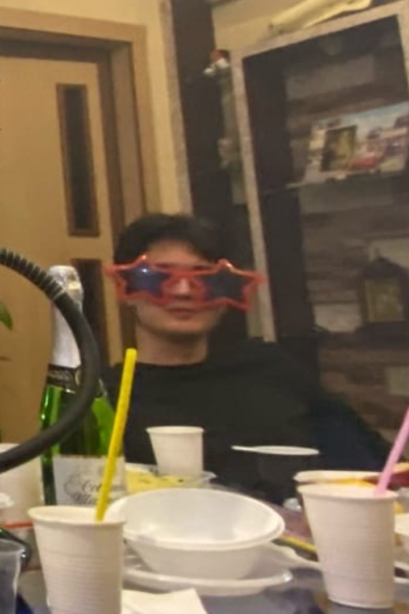

# My CV
## Shekerbekov Islam

### Contact
telegram: @anecdote_man  
VK: https://vk.com/anecdoteman  
github: https://github.com/Pivodur  
discord at RS-school: Syamba(@Pivodur)
### About me 
I am a student of STU in Kazakhstan. For 2 years of attending my university I have learned nothing useful. So I decided to submit to RS school course.
I like cooking and programming because these are the things where I can control as much as I am able. And every time I create a new project or an experiment I get new experience.
It gives me relief and desire to learn more.
### Skills 
I know a bit of Python, some HTML and CSS.
I am not deprived of soft skills. That is not hard for me to get close with people or, vice versa, mark bounds between me and a person.
### Code 
```javascript
const smallestDivisor = (num) => {
  if (num === 1) {
    return 1;
  };
  const iter = (start, num) => {
    if (num % start === 0) {
      return start;
    };
    return iter(start + 1, num);
  };

  return iter(2, num);
};
```
### Experience
I have already made two landings on the course of Vadim Prokopchuk. i used Html and CSS for this.
Also I made this task
### Education 
HTML and CSS course of Vadim Prokopchuk
### Languages
I have never taken an exam that can give an approval of skills. But I am sure that I am least B1 in reading and writing, and A2 in listening and speaking

